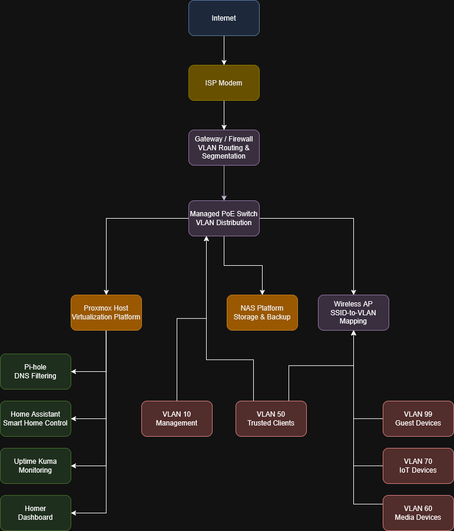

# Homelab Network Architecture

## Overview

This repository documents the design, deployment, troubleshooting, and evolution of a segmented homelab infrastructure environment built to simulate production-style operational practices.

The environment is focused on:
- network segmentation
- virtualization
- infrastructure services
- self-hosted applications
- operational reliability
- security boundaries
- documentation discipline

This project serves both as:
- a long-term engineering knowledge base
- a portfolio of infrastructure and systems administration work

---

## Core Objectives

- Build a segmented multi-VLAN network
- Separate trusted, infrastructure, IoT, media, and guest systems
- Develop production-style operational workflows
- Improve troubleshooting and infrastructure documentation practices
- Learn scalable infrastructure design principles
- Create repeatable deployment standards

---

## Environment Overview

### Network Infrastructure
- UniFi Gateway
- Managed PoE Switching
- VLAN segmentation
- Multi-SSID wireless architecture

### Virtualization Platform
- Proxmox VE
- Linux Containers (LXC)
- Virtual Machines

### Infrastructure Services
- Pi-hole
- Home Assistant
- Uptime Kuma
- Homer Dashboard

### Storage & Backup
- TrueNAS SCALE (planned/active depending on deployment phase)
- ZFS-based storage planning
- NAS infrastructure development

---

## Technologies Used

- Proxmox VE
- UniFi Networking
- VLAN Segmentation
- Linux Containers (LXC)
- Pi-hole
- Uptime Kuma
- Homer Dashboard
- TrueNAS SCALE
- ZFS Storage Planning
- Infrastructure Documentation
- Network Segmentation
- Self-Hosted Services

---

## Topology Diagram

## VLAN & Trust Zone Strategy

| VLAN | Purpose | Description |
|---|---|---|
| 10 | Management | Administrative and infrastructure management |
| 50 | Trusted Clients | Primary trusted devices |
| 60 | Media | Streaming and casting devices |
| 70 | IoT | Smart home and untrusted devices |
| 99 | Guest | Internet-only guest access |

---

## Documentation Areas

| Directory | Purpose |
|---|---|
| `docs/architecture` | Network and infrastructure design |
| `docs/deployment` | Deployment procedures and platform integration |
| `docs/troubleshooting` | Operational incidents and troubleshooting history |
| `docs/lessons-learned` | Engineering and operational lessons |
| `docs/changelog` | Repository milestone tracking |
| `images` | Sanitized diagrams and screenshots |
| `references` | Supporting research and implementation references |

---

## Current Focus Areas

- VLAN standardization
- Infrastructure segmentation
- Service migration into Proxmox
- Monitoring and observability
- Documentation maturity
- Infrastructure scalability planning

---

## Design Philosophy

This environment prioritizes:
- operational clarity
- maintainability
- segmentation and trust boundaries
- iterative infrastructure improvement
- documentation-first engineering practices

The project intentionally documents:
- successful deployments
- failed configurations
- troubleshooting methodology
- operational improvements
- architectural decision-making

---

## Security & Sanitization

All sensitive information has been removed or generalized prior to publication, including:
- public IP information
- credentials
- private DNS entries
- VPN configuration details
- internal identifiers
- infrastructure exposure details

---

## Repository Status

Active development and documentation project.

Architecture, deployment notes, troubleshooting history, and operational lessons will continue expanding as the environment evolves.

---

## Current Repository Milestone

### v1.0 — Initial Infrastructure Architecture Documentation

Current repository scope includes:
- network segmentation architecture
- infrastructure standards
- Proxmox integration
- troubleshooting documentation
- operational lessons learned
- service inventory tracking
- monitoring philosophy
- backup and recovery planning
- topology diagrams
- infrastructure evolution tracking

---

## Planned Future Expansion

Future repository growth areas include:
- infrastructure automation
- observability tooling
- advanced monitoring
- infrastructure-as-code experimentation
- cloud integration
- platform engineering concepts

---

## License

This repository is published under the MIT License.
